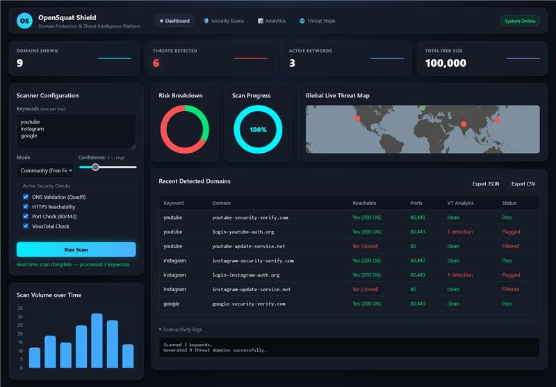
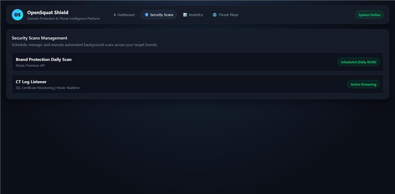
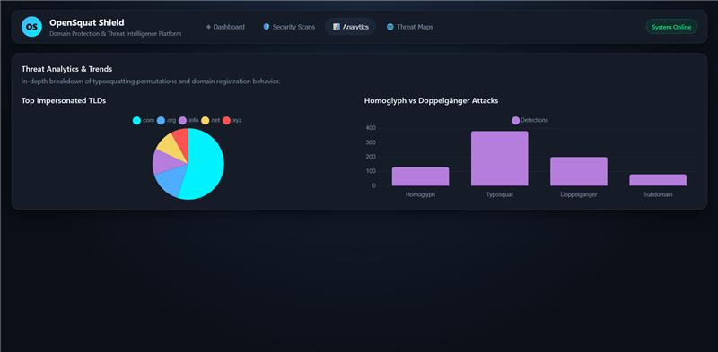
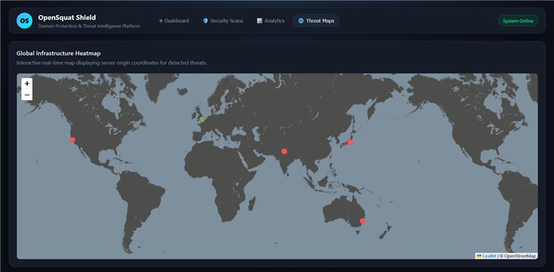
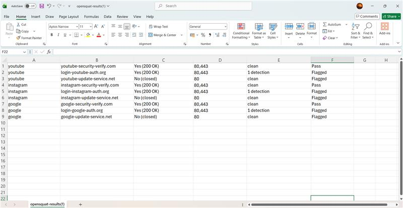

# 🛡️ OpenSquat Shield

### Domain Protection & Threat Intelligence Platform

A cybersecurity dashboard for detecting suspicious domain impersonation, analyzing threats, and visualizing security intelligence.


</div>

---

## 📌 About

**OpenSquat Shield** is a web-based cybersecurity and threat intelligence platform designed to identify suspicious domains that may imitate legitimate brands or keywords.

It combines domain analysis, security checks, threat indicators, analytics, and an interactive dashboard.

## 🎯 Objectives

- Detect suspicious domain variations and impersonation attempts.
- Identify typosquatting, homoglyph, and doppelgänger domains.
- Perform DNS, HTTPS, port, and threat-intelligence checks.
- Present scan results through an interactive dashboard.
- Provide threat analytics and visualization.
- Export results in JSON and CSV.

## ✨ Key Features

| Feature | Description |
|---|---|
| 🔎 Domain Detection | Finds suspicious domain variations related to monitored keywords. |
| 🔤 Typosquatting | Detects common spelling variations. |
| 🧬 Homoglyph Detection | Identifies visually similar character substitutions. |
| 🎭 Doppelgänger Detection | Identifies look-alike domain patterns. |
| 🌐 DNS Validation | Performs DNS resolution checks using Quad9. |
| 🔒 HTTPS Check | Checks HTTPS reachability. |
| 🚪 Port Check | Checks common web ports such as 80 and 443. |
| 🦠 VirusTotal | Supports additional threat analysis when configured. |
| 📊 Analytics | Displays threat and attack-pattern statistics. |
| 🗺️ Threat Map | Interactive global visualization of threat infrastructure. |
| 📤 Export | Exports scan results as JSON and CSV. |

## 🖥️ Dashboard

The dashboard provides:

- **Domains Shown**
- **Threats Detected**
- **Active Keywords**
- **Total Feed Size**
- Scan volume charts
- Risk breakdown
- Scan progress
- Recent detected domains
- Scan activity logs

### Scanner Configuration

Users can configure keywords, scan mode, confidence level, DNS validation, HTTPS reachability, port checking, and VirusTotal analysis.

## 🔐 Security Scanning

Available monitoring options include:

- **Brand Protection Daily Scan**
- **Premium API scan mode**
- **CT Log Listener**
- **SSL Certificate Monitoring**

## 📊 Threat Analytics

The Analytics section includes:

- Top Impersonated TLDs
- Homoglyph vs Doppelgänger attacks
- Risk breakdown
- Scan statistics

## 🌍 Global Threat Map

OpenSquat Shield includes an interactive **Leaflet.js** map for visualizing infrastructure information associated with detected threats.

## 📸 Screenshots

### Dashboard
<p align="center"></p>

### Security Scans
<p align="center"></p>

### Threat Analytics
<p align="center"></p>

### Threat Map
<p align="center"></p>

### Scan Results
<p align="center"></p>

## 🏗️ System Workflow

```text
User Keywords
      ↓
Domain Detection & Variation Analysis
      ↓
Suspicious Domain Identification
      ↓
DNS / HTTPS / Port Checks
      ↓
Threat Intelligence & Risk Analysis
      ↓
Dashboard + Analytics + Threat Map
      ↓
JSON / CSV Export
```

## 🛠️ Technology Stack

**Frontend:** HTML5, CSS3, JavaScript, Chart.js, Leaflet.js

**Backend:** Python, FastAPI, Uvicorn, Pydantic

**Security:** DNS validation, HTTPS checks, port checking, VirusTotal integration, domain-squatting analysis, homoglyph analysis, phishing/threat indicators.

## 📁 Project Structure

```text
OpenSquatShield/
├── opensquat/
├── opensquat-web/
│   ├── static/
│   │   ├── index.html
│   │   ├── app.js
│   │   └── style.css
│   ├── scanner_service.py
│   ├── server.py
│   └── requirements.txt
├── screenshots/
│   ├── opensquat1.jpg
│   ├── opensquat2.jpg
│   ├── opensquat3.jpg
│   ├── opensquat4.jpg
│   └── opensquat5.jpg
├── tests/
├── opensquat.py
├── requirements.txt
├── pyproject.toml
├── LICENSE
└── README.md
```

## ⚙️ Installation

```bash
git clone https://github.com/shobha-06/OpenSquatShield.git
cd OpenSquatShield
python -m venv venv
```

**Windows:**
```bash
venv\Scripts\activate
```

**Linux/macOS:**
```bash
source venv/bin/activate
```

Install dependencies:

```bash
pip install -r requirements.txt
pip install -r opensquat-web/requirements.txt
```

## ▶️ Run the Web Dashboard

```bash
cd opensquat-web
uvicorn server:app --reload
```

Then open the local URL shown by Uvicorn in your browser.

> If your local FastAPI entry point has a different filename, replace `server:app` with the correct module and application name.

## 📤 Export Results

Scan results can be exported as:

- JSON
- CSV

## 🔑 API Key Security

**Never publish real API keys on GitHub.**

Use environment variables or another secure configuration method for real credentials:

```text
VIRUSTOTAL_API_KEY=your_api_key_here
```

## 🔮 Future Scope

- 🤖 Machine-learning-based domain classification
- 🔔 Automated alerts
- ⏱️ Advanced scheduled monitoring
- 🧠 Improved phishing detection
- 📈 Historical threat intelligence
- ☁️ Cloud deployment
- 👥 Role-based access control
- 🔍 Additional threat-intelligence feeds
- 🎯 Advanced automated threat scoring

## 🎓 Academic Project

OpenSquat Shield was developed as a **BCA cybersecurity project** to demonstrate practical concepts in cybersecurity, threat intelligence, domain security, brand protection, phishing detection, DNS/network security, monitoring, and data visualization.

## 👩‍💻 Author

**Shobha**  
BCA Student | Cybersecurity Project

GitHub: [shobha-06](https://github.com/shobha-06)

## ⚠️ Disclaimer

This project is intended for **educational, research, and authorized security-monitoring purposes only**.

Do not use this project to scan, monitor, or analyze systems or infrastructure without proper authorization.


### 🛡️ OpenSquat Shield
**Protect • Detect • Analyze**
